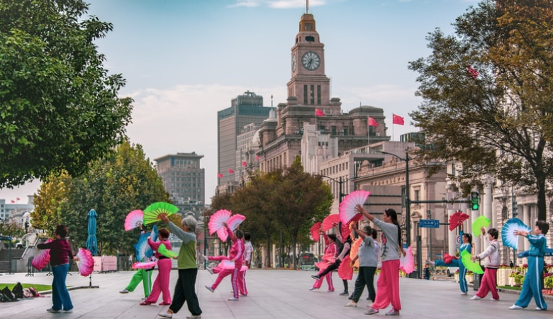

```{r setup, include=FALSE}
options(htmltools.dir.version = FALSE)
```

```{r , echo = FALSE, message = FALSE, warning = FALSE}
library(tidyverse)
library(datasets)
library(readxl)
library(kableExtra)
library(bookdown)
library(ggplot2)
library(stringr)
library(lubridate)
library(plotly)
library("janitor")
library("kableExtra")
library("plotly")
library("countrycode")
library(data.table)
```

```{r read-data, include=FALSE}
# Read the data
WHR20 <- read_excel("Data/WHR20_DataForFigure2.1.xls")
```

class: center, middle
# .red[World Happiness Report]

.tiny[<span>Photo by <a href="https://giphy.com/disneyzootopia">Disney</a> on <a href="https://giphy.com/gifs/3NtY188QaxDdC/links">Giphy</a></span>]


---
class: center, middle
# Introduction

### Did you know countries are ranked each year based on a Happiness Index?

.content-box-green[ 
Countries are ranked each year based on a **Happiness Index**. This index rates the happiness of countries on a scale from 0 to 10, and it’s pretty fascinating!
]


---
class: center, middle
# Happiness Score by Region

```{r include=FALSE}
happiness <- WHR20 %>% 
  select(`Country name`,`Regional indicator`,`Ladder score`,`Logged GDP per capita`,`Social support`,`Healthy life expectancy`,`Freedom to make life choices`,Generosity,`Perceptions of corruption`) %>% 
  mutate(`Happiness Rank` = rank(-`Ladder score`)) %>% 
  rename(`Happiness Score` = `Ladder score`) %>% clean_names()
#happiness rank : the more the ladder score the higher the rank              
```

```{r regiontable, include=FALSE}
reg_avg <- happiness %>%
  select(regional_indicator,happiness_score) %>%
  group_by(regional_indicator) %>%
  summarize(Average = mean(happiness_score)) %>% 
  arrange(-Average)
```

```{r include=FALSE}
happiness$iso3 <- countrycode(happiness$country_name, 'country.name', 'iso3c')
happiness[happiness$country_name=="Kosovo","iso3"] <- "XKX"
```

```{r region, fig.align='center',fig.height=6,fig.width=10, echo=FALSE, warning=FALSE, message=FALSE}
plot_ly(happiness, x=~regional_indicator,
              y=~happiness_score,
              type="box",
              boxpoints="all",
              color=~regional_indicator,
        text = ~paste("<b>Region:</b> ", regional_indicator,
                      "<br><b>Country:</b> ", country_name,
                      "<br><b>Happiness Score:</b>", happiness_score))%>%
  layout(xaxis=list(showticklabels = FALSE),
         yaxis=list(title="Happiness Score"),
         legend=list(font = (size = 5)),
         margin=list(b = 100),
         title="Box Plot of Happiness Score by Region")
```

---
class: left, top
## Which Region looks the happiest?

* We have collected happiness data from World Happiness Report for 2020. It has global happiness that ranks 156 countries by how happy their citizens perceive themselves to be.<br>

* The group determined that the **“happiest”** countries were located in **Western Europe**, particularly Finland and Denmark.<br>
* Meanwhile the **“least happiest”** countries were located in **Sub-Saharan Africa** and **South Asia**. 


---
class: center, middle
# Logged GDP per capita 

# v.s. 

# Happiness

“The richer you are, the happier you will be?”

```{r out.width = '50%', echo = FALSE, fig.align="center"}
knitr::include_graphics("figs/GDP.png")
```

.tiny[<span>Photo by <a href="https://unsplash.com/@till_indeman">Vladimir Solomyani</a> on <a href="https://unsplash.com/photos/rKPiuXLq29A">Unsplash</a></span>]

---
class: center, middle
## Ladder Score vs Logged GDP per capita in Different Regions

```{r GDP-ord, echo = FALSE, out.width='80%', fig.height = 4.5}
gdp_mean <- WHR20 %>% 
  group_by(`Regional indicator`) %>% 
  summarise(Average 
            = round(mean(`Logged GDP per capita`),2))%>%
  arrange(-Average)

  gdp_mean %>% 
    kable() %>%
      kable_styling(bootstrap_options = c("striped", "hover"))
```

---
class: center, middle
### Ladder Score vs GDP for the High GDP Regions

```{r GDP-high, echo = FALSE, fig.align="center", out.width='80%', fig.height = 4.5}
WHR20 %>%
  filter(!`Regional indicator` %in% 
           c("Commonwealth of Independent States",
             "South Asia", 
             "Sub-Saharan Africa")) %>% 
  ggplot(aes(x = `Ladder score`, 
             y = `Logged GDP per capita`,
             color = `Regional indicator`)) +
  geom_point() +
  geom_vline(aes(xintercept = 5.47324),
             linetype = "dashed") +
  geom_hline(aes(yintercept =9.295706),
             linetype = "dashed") +
  facet_wrap(~`Regional indicator`, ncol = 3) +
  theme(legend.position = "none")

```

---
class: center, middle
### Ladder Score vs Logged GDP for the Low GDP Regions

```{r GDP-low, echo = FALSE, fig.align="center", out.width='80%', fig.height = 2}
 WHR20 %>%
  filter(`Regional indicator` %in% 
           c("Commonwealth of Independent States",
             "South Asia", 
             "Sub-Saharan Africa")) %>% 
  ggplot(aes(x = `Ladder score`, 
             y = `Logged GDP per capita`,
             color = `Regional indicator`)) +
  geom_point() +
  geom_vline(aes(xintercept = 5.47324),
             linetype = "dashed") +
  geom_hline(aes(yintercept =9.295706),
             linetype = "dashed") +
  facet_wrap(~`Regional indicator`, ncol = 3)+
  theme(legend.position = "none")
```

---

**In High GDP Regions:**

- Counties in most regions, they are with either high GDP and high Ladder Score or low GDP and low Ladder Scores.

- In Central and Eastern Europe and Middle East and North Africa, some countries got high GDP scores but low Ladder Scores.

- In Latin America and Caribbean, some countries even their GDP are low but have high Ladder Scores.

**In Low GDP Regions:**

- In above low GDP countries, most are low GDP and low Ladder Scores.

---
class: center, middle
# Social Support 

# v.s. 

# Happiness

“If you were in trouble, do you have relatives or friends you can count on to help you whenever you need them, or not?”

```{r out.width = '50%', echo = FALSE, fig.align="center"}
knitr::include_graphics("figs/SS.png")
```

.tiny[<span>Photo by <a href="https://unsplash.com/@_imd">Zoe</a> on <a href="https://unsplash.com/photos/0X3b5AL9Rb4">Unsplash</a></span>]

---
class: center, middle
## Ladder Score vs Social Support in Different Regions

```{r SS-ord, echo = FALSE, out.width='80%', fig.height = 4.5}
SS_mean <- WHR20 %>% 
  group_by(`Regional indicator`) %>% 
  summarise(Average 
            = round(mean(`Social support`),2))%>%
  arrange(-Average)

  SS_mean %>% 
    kable() %>%
      kable_styling(bootstrap_options = c("striped", "hover"))
```


---
class: center, middle
### Ladder Score vs Social Support for the High Social Support Regions

```{r SS-high, echo = FALSE, fig.align="center", out.width='80%', fig.height = 4.5}
 WHR20 %>%
  filter(!`Regional indicator` %in% 
           c("Middle East and North Africa",
             "South Asia", 
             "Sub-Saharan Africa")) %>% 
  ggplot(aes(x = `Ladder score`, 
             y = `Social support`,
             color = `Regional indicator`)) +
  geom_point() +
  geom_vline(aes(xintercept = 5.47324),
             linetype = "dashed") +
  geom_hline(aes(yintercept = 0.8087211),
             linetype = "dashed") +
  facet_wrap(~`Regional indicator`, ncol = 3)+
  theme(legend.position = "none")
```

---
class: center, middle
### Ladder Score vs Social Support for the Low Social Support Regions

```{r SS-low, echo = FALSE, , fig.align="center", out.width='80%', fig.height = 2}
 WHR20 %>%
  filter(`Regional indicator` %in% 
           c("Middle East and North Africa",
             "South Asia", 
             "Sub-Saharan Africa")) %>% 
  ggplot(aes(x = `Ladder score`, 
             y = `Social support`,
             color = `Regional indicator`)) +
  geom_point() +
  geom_vline(aes(xintercept = 5.47324),
             linetype = "dashed") +
  geom_hline(aes(yintercept = 0.8087211),
             linetype = "dashed") +
  facet_wrap(~`Regional indicator`, ncol = 3)+
  theme(legend.position = "none")
```

---

- We nearly found no country has low Social Support score but got high Ladder Score. 

- In North America and ANZ, Southeast Asia, South Asia, Middle East and North Africa and Western Europe, Social Support and Ladder Score is more like positive correlation.

- In other Region, it doesn't show clear relationship between Social Support and Ladder Score.

---
class: center, middle
# Healthy Life Expectancy 

# v.s. 

# Happiness

“Long and Healthy Life = Happy Life?”

```{r out.width = '50%', echo = FALSE, fig.align="center"}

```

.tiny[<span>Photo by <a href="https://unsplash.com/@adliwahid">Adli Wahid</a> on <a href="https://unsplash.com/photos/YdVBgegbzQw">Unsplash</a></span>]

---
class: center, middle
## Ladder Score vs Healthy Life Expectancy in Different Regions

```{r HLE-ord, echo = FALSE}
HLE_mean <- WHR20 %>% 
  group_by(`Regional indicator`) %>% 
  summarise(Average 
            = round(mean(`Healthy life expectancy`),2))%>%
  arrange(-Average)

  HLE_mean %>% 
    kable() %>%
      kable_styling(bootstrap_options = c("striped", "hover"))
```

---
class: center, middle
### Ladder Score vs Healthy Life Expectancy for the High Healthy Life Expectancy Regions

```{r HLE-high, echo = FALSE, fig.align="center", out.width='80%', fig.height = 4.5}
 WHR20 %>%
  filter(!`Regional indicator` %in% 
           c("South Asia", 
             "Sub-Saharan Africa")) %>% 
  ggplot(aes(x = `Ladder score`, 
             y = `Healthy life expectancy`,
             color = `Regional indicator`)) +
  geom_point() +
  geom_vline(aes(xintercept = 5.47324),
             linetype = "dashed") +
  geom_hline(aes(yintercept = 64.44553),
             linetype = "dashed") +
  facet_wrap(~`Regional indicator`, ncol = 3)+
  theme(legend.position = "none")
```

---
class: center, middle
### Ladder Score vs Healthy Life Expectancy for the Low Healthy Life Expectancy Regions

```{r HLE-low, echo = FALSE, , fig.align="center", out.width='80%', fig.height = 2}
 WHR20 %>%
  filter(`Regional indicator` %in% 
           c("South Asia", 
             "Sub-Saharan Africa")) %>% 
  ggplot(aes(x = `Ladder score`, 
             y = `Healthy life expectancy`,
             color = `Regional indicator`)) +
  geom_point() +
  geom_vline(aes(xintercept = 5.47324),
             linetype = "dashed") +
  geom_hline(aes(yintercept = 64.44553),
             linetype = "dashed") +
  facet_wrap(~`Regional indicator`, ncol = 3)+
  theme(legend.position = "none")
```

---

**In High Healthy Life Expectancy Score Regions:**

- In the high Healthy Life Expectancy score countries group, it shows a positive correlation in Southeast Asia, Middle East and North Africa and North America and ANZ. 

- In the Commonwealth of Independent States, Central and Eastern Europe, Western Europe, some countries are almost at the same level of Healthy life Expectancy, their Ladder Scores arrange from a big difference.

**In Low Healthy Life Expectancy Score Regions:**

- They also have a low Ladder Score, while they don't look have a special relationship between Healthy Life Expectancy and Ladder Score. 

---
class: center, middle
# Freedom to Make Life Choices v.s. Happiness

“Are you satisfied or dissatisfied with your freedom to choose what you do with your life?”


```{r out.width = '80%', echo = FALSE, fig.align="center"}

```

.tiny[<span>Photo by <a href="https://auralcrave.com/en/author/auralcrave/">Carlo Affatigato</a> on <a href="https://auralcrave.com/en/2020/10/18/the-art-of-making-right-life-choices-and-important-decisions/">Unsplash</a></span>]
---
class: left, top
# Grouping

```{r ,include=FALSE}
free_avg <- WHR20 %>%
  group_by(`Regional indicator`) %>% 
  summarise(average = mean(`Freedom to make life choices`)) %>% 
  arrange(desc(average))
```

```{r, message=FALSE, warning=FALSE, echo=FALSE, eval=TRUE, message=FALSE}
knitr::kable(free_avg, caption = "Average Freedom to Make Life Choices Score by Region",
      col.names = c("Region", "Average Score")) %>% 
  kable_styling(c("hover", 
                  "condensed",
                  position = "center", 
                  fixed_thead = TRUE))
```

---
class: left, top
# High Group

```{r freeh, fig.cap="The Group of High Freedom to Make Life Choices Score", fig.width=10, message=FALSE, warning=FALSE, echo=FALSE, eval=TRUE, message=FALSE}
 WHR20 %>%
  filter(`Regional indicator` %in% c("Southeast Asia",  "North America and ANZ", "Western Europe", "Latin America and Caribbean")) %>% 
  ggplot(aes(x = `Ladder score`, 
             y = `Freedom to make life choices`)) +
  geom_point() +
  facet_grid(~`Regional indicator`)+
  geom_vline(aes(xintercept = mean(WHR20$`Ladder score`)),
             linetype = "dashed") +
  geom_hline(aes(yintercept = mean(WHR20$`Freedom to make life choices`)),
             linetype = "dashed") 
```

---
class: left, top
# Middle Group

```{r freem, fig.cap="The Group of Middle Freedom to Make Life Choices Score", fig.width=10, message=FALSE, warning=FALSE, echo=FALSE, eval=TRUE, message=FALSE}
WHR20 %>%
  filter(`Regional indicator` %in% c("Commonwealth of Independent States", "South Asia", "Central and Eastern Europe", "East Asia")) %>% 
  ggplot(aes(x = `Ladder score`, 
               y = `Freedom to make life choices`)) +
  geom_point() +
  facet_grid(~`Regional indicator`) +
  geom_vline(aes(xintercept = mean(WHR20$`Ladder score`)),
             linetype = "dashed") +
  geom_hline(aes(yintercept = mean(WHR20$`Freedom to make life choices`)),
             linetype = "dashed") 
```

---
class: left, top
# Low Group

```{r freel, fig.cap="The Group of Low Freedom to Make Life Choices Score", message=FALSE, warning=FALSE, echo=FALSE, eval=TRUE, message=FALSE}
 WHR20 %>%
  filter(`Regional indicator` %in% c("Sub-Saharan Africa", "Middle East and North Africa")) %>% 
  ggplot(aes(x = `Ladder score`, 
               y = `Freedom to make life choices`)) +
  geom_point() +
  facet_grid(~`Regional indicator`) +
  geom_vline(aes(xintercept = mean(WHR20$`Ladder score`)),
             linetype = "dashed") +
  geom_hline(aes(yintercept = mean(WHR20$`Freedom to make life choices`)),
             linetype = "dashed") 
```

---
class: left, top
# Is Freedom to Make Life Choices related to happiness?

Except Southeast Asia, and Middle East and North Africa,

.content-box-soft[ 
the ladder score **is related to** the “Freedom to make life choices” score in most of the regions.
]

---
class: center, middle
# Generosity v.s. Happiness

“Have you donated money to a charity in the past month?”


```{r out.width = '80%', echo = FALSE, fig.align="center"}
knitr::include_graphics("figs/janie_img_02.jpeg")
```

.tiny[<span>Photo by <a href="https://ampac-us.com/author/jean-j-brown">Jean J. Brown</a> on <a href="https://ampac-us.com/one-off-donation.html">Unsplash</a></span>]

---
class: left, top
# Grouping

```{r, include=FALSE}
gene_avg  <- WHR20 %>%
  group_by(`Regional indicator`) %>% 
  summarise(average = mean(`Generosity`)) %>% 
  arrange(desc(average))
```

```{r tabgene, message=FALSE, warning=FALSE, echo=FALSE, eval=TRUE, message=FALSE}
knitr::kable(gene_avg, caption = "The Average Generosity Score by Region",
                col.names = c("Region", "Average Score")) %>% 
  kable_styling(c("hover", 
                  "condensed",
                  position = "center", 
                  fixed_thead = TRUE))
```

---
class: left, top
# Group higher than 0

```{r geneh, fig.cap="The Group of the Generosity Score Less Than 0", fig.width=10, message=FALSE, warning=FALSE, echo=FALSE, eval=TRUE, message=FALSE}
 WHR20 %>%
  filter(`Regional indicator` %in% c("North America and ANZ","Southeast Asia","Western Europe","South Asia","Sub-Saharan Africa")) %>% 
  ggplot(aes(x = `Ladder score`, 
             y = `Generosity`)) +
  geom_point() +
  facet_grid(~`Regional indicator`) +
  geom_vline(aes(xintercept = mean(WHR20$`Ladder score`)),
             linetype = "dashed") +
  geom_hline(aes(yintercept = mean(WHR20$`Generosity`)),
             linetype = "dashed") 
```


---
class: left, top
# Group less than 0

```{r genel, fig.cap="The Group of the Generosity Score Higher Than 0", fig.width=10, message=FALSE, warning=FALSE, echo=FALSE, eval=TRUE, message=FALSE}
 WHR20 %>%
  filter(`Regional indicator` %in% c("Commonwealth of Independent States","East Asia","Latin America and Caribbean","Middle East and North Africa","Central and Eastern Europe")) %>% 
  ggplot(aes(x = `Ladder score`, 
               y = `Generosity`)) +
  geom_point() +
  facet_grid(~`Regional indicator`) +
  geom_vline(aes(xintercept = mean(WHR20$`Ladder score`)),
             linetype = "dashed") +
  geom_hline(aes(yintercept = mean(WHR20$`Generosity`)),
             linetype = "dashed") 
```


---
class: left, top
# Is Generosity related to happiness?

.content-box-soft[ 
In general, the generosity score does **not** show a relationship with the ladder score.
]


---
class: center, middle
# Perceptions of corruption v.s. Happiness

“Is corruption widespread within businesses or not?”

```{r out.width = '80%', echo = FALSE, fig.align="center"}

```

.tiny[<span>Photo by <a href="https://ampac-us.com/author/jean-j-brown">Jean J. Brown</a> on <a href="https://ampac-us.com/one-off-donation.html">Unsplash</a></span>]


.tiny[<span>Photo by <a href="https://ampac-us.com/author/jean-j-brown">Jean J. Brown
</a> on <a href=“https://ampac-us.com/one-off-donation.html">Unsplash</a></span>]

---
class: left, top
# Grouping
```{r, include=FALSE}
perc_avg  <- WHR20 %>%
  group_by(`Regional indicator`) %>% 
  summarise(average = mean(`Perceptions of corruption`)) %>% 
  arrange(desc(average))
```


```{r tabcor, message=FALSE, warning=FALSE, echo=FALSE, eval=TRUE, message=FALSE}
knitr::kable(perc_avg, caption = "The Perceptions of Corruption Score by Region",
                col.names = c("Region", "Average Score")) %>% 
  kable_styling(c("hover", 
                  "condensed",
                  position = "center", 
                  fixed_thead = TRUE))
```

---
class: left, top
# Low Group 

```{r corl, fig.cap="The Group of Low Perceptions of Corruption Score", message=FALSE, warning=FALSE, echo=FALSE, eval=TRUE, message=FALSE}
 WHR20 %>%
  filter(`Regional indicator` %in% c("Western Europe","North America and ANZ")) %>% 
  ggplot(aes(x = `Ladder score`, 
               y = `Perceptions of corruption`)) +
  geom_point() +
  facet_grid(~`Regional indicator`) +
  geom_vline(aes(xintercept = mean(WHR20$`Ladder score`)),
             linetype = "dashed") +
  geom_hline(aes(yintercept = mean(WHR20$`Perceptions of corruption`)),
             linetype = "dashed") 
```

---
class: left, top
# Middle Group 

```{r corm, fig.cap="The Group of Middle Perceptions of Corruption Score", fig.width=10, message=FALSE, warning=FALSE, echo=FALSE, eval=TRUE, message=FALSE}
 WHR20 %>%
  filter(`Regional indicator` %in% c("South Asia","Sub-Saharan Africa","Middle East and North Africa", "Commonwealth of Independent States","Southeast Asia","East Asia")) %>% 
  ggplot(aes(x = `Ladder score`, 
               y = `Perceptions of corruption`)) +
  geom_point() +
  facet_grid(~`Regional indicator`) +
  geom_vline(aes(xintercept = mean(WHR20$`Ladder score`)),
             linetype = "dashed") +
  geom_hline(aes(yintercept = mean(WHR20$`Perceptions of corruption`)),
             linetype = "dashed") 
```

---
class: left, top
# High Group 

```{r corh, fig.cap="The Group of High Perceptions of Corruption Score", fig.width=10,  message=FALSE, warning=FALSE, echo=FALSE, eval=TRUE, message=FALSE}
 WHR20 %>%
  filter(`Regional indicator` %in% c("Central and Eastern Europe","Latin America and Caribbean")) %>% 
  ggplot(aes(x = `Ladder score`, 
               y = `Perceptions of corruption`)) +
  geom_point() +
  facet_grid(~`Regional indicator`) +
  geom_vline(aes(xintercept = mean(WHR20$`Ladder score`)),
             linetype = "dashed") +
  geom_hline(aes(yintercept = mean(WHR20$`Perceptions of corruption`)),
             linetype = "dashed") 
```


---
class: left, top
# Is Perceptions of corruption related to happiness?

.content-box-soft[ 
- The lowest and the highest four regions all have a high ladder score. 

- Most of the regions in the middle score groups show the middle ladder score.
]

---
class: center, middle
## Compare Top5, Middle5 and Worst5 Countries

```{r include=FALSE}
top5 <- happiness %>% head(5) %>% mutate(Level = "TOP5")
middle5 <- happiness[76:80, ] %>% mutate(Level = "MIDDLE5")
worst5 <- happiness %>% tail(5) %>% mutate(Level = "WORST5")
comparison <- bind_rows(top5, middle5, worst5)
comparison$Level <- as.factor(comparison$Level)
comparison <- transform(comparison, Level = factor(Level, levels = c("TOP5", "MIDDLE5", "WORST5" )))
```

```{r include=FALSE}
data.table(comparison,
          options = list(
            lengthMenu = c(5, 10, 15)
          ),
          caption = 
            htmltools::tags$caption(
              style = 'caption-side: bottom; text-align: center;', 
              htmltools::em('Data table that only includes top5, middle5 and worst5 countries'))
          )
```

```{r include=FALSE}
comparison.score <- comparison %>% rename("Economy GDP" = "logged_gdp_per_capita" , "Social Support" = "social_support" , "Health" = "healthy_life_expectancy", "Freedom" = "freedom_to_make_life_choices", "Corruption" ="perceptions_of_corruption") %>% 
  gather(key = "columns", value = "score", happiness_score:Corruption)
```


```{r compare, fig.width=10, echo=FALSE, warning=FALSE, message=FALSE}
comparison.score %>% 
  ggplot(aes(x = Level, y = score, colour = Level, fill = Level)) + 
  geom_boxplot(position=position_dodge(width=1)) + facet_wrap(~columns, scales = "free") 
```


---
class: left, top
## Factors determining Happiness.

* Analyzing data of Global Happiness Levels in the world,we were able to discover the impact of each different factor in determining “happiness.”

* We observe that the countries with highest happiness score have a better GDP, less corruption, more freedom to make choices, good health ratio, more generosity and receive social support. 

```{r out.width = '35%', echo = FALSE, fig.align="center"}

```

.tiny[<span>Photo by <a href="https://thriveglobal.com/stories/happiness-trends-up-except-where-it-matters-most/">Thrive Global</a></span>]
---
class: center, middle

**Happiness Score for Countries**

The WHR calculates how much of the Happiness Index can be explained by the key factors. Add them all up and you should get close to the actual number. <br>

```{r map, fig.width=10, echo=FALSE, warning=FALSE, message=FALSE}
fig <- plot_ly(happiness, type='choropleth', locations= happiness$iso3 , z= happiness$happiness_score, text= ~paste(
                      "<br><b>Country:</b> ", country_name,
                      "<br><b>Happiness rank:</b>", happiness_rank), colorscale="Viridis")
fig <- fig %>% colorbar(title = "Happiness Score" )
fig <- fig %>% layout(
    title = 'World Happiness Map, Year 2020')
fig
```


---

```{r endslide, child="EndSlide/endslide.Rmd"}
```  